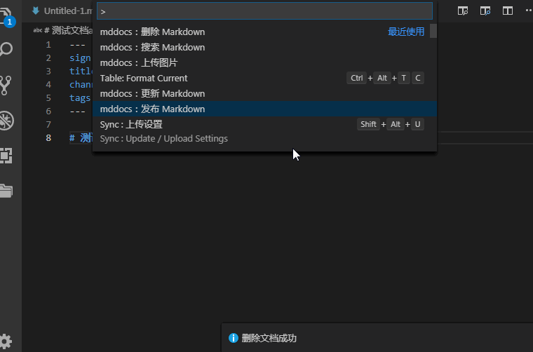
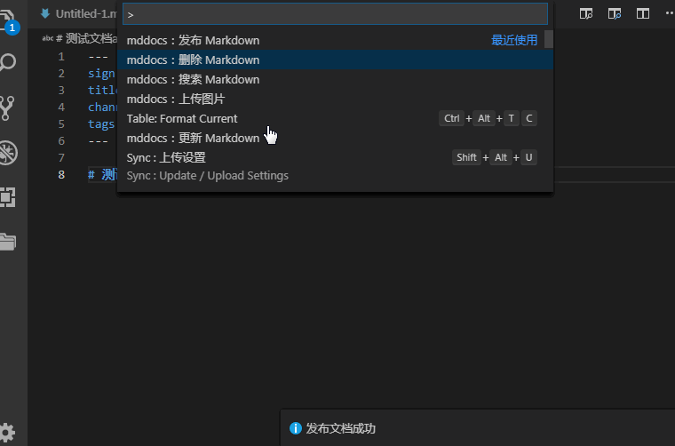
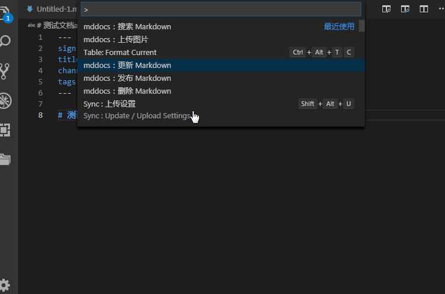
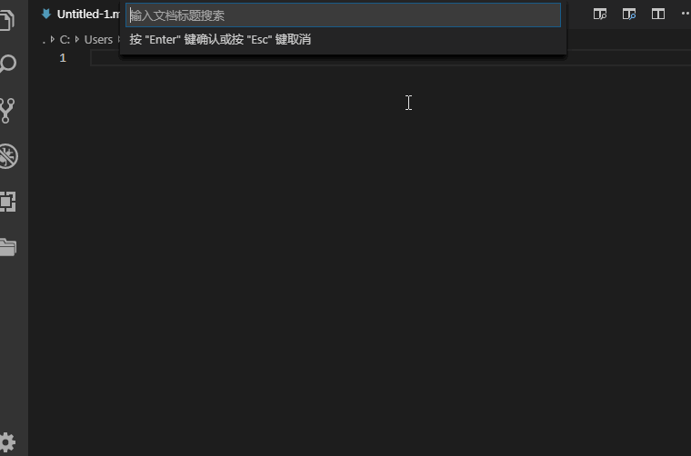
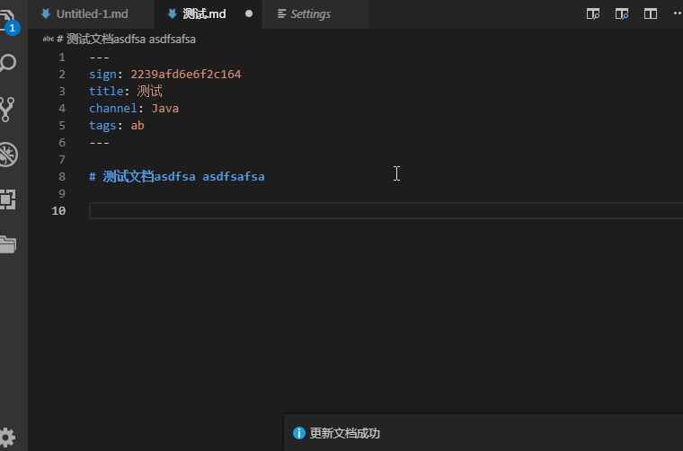

# MdDocs

mddoc主要通过 *Restful Api* 方式集中管理服务器上的 *markdown* 文档，插件提供 **发布、更新、删除、查询** 等4个操作项来管理文档。

## 配置参数

|      *参数*      | *是否必须* |                          *描述*                           |
| ---------------- | ---------- | --------------------------------------------------------- |
| mddocs开关配置   | 是         | 默认为：true，即开启mddocs                                |
| 上传图片前缀开关 | 否         | 默认：false，开启后上传图片时将追加元数据`path`指定的前缀 |
| Api 请求路径     | 是         | 服务器Restful Api 接口调用根路径                          |
| 授权访问凭证     | 是         | 用户标识符，用于接口调用的合法凭证                        |
| 發佈文檔uri      | 否         | 發佈文檔uri地址，默認：**/api/publishMd**                 |
| 修改文檔uri      | 否         | 修改文檔uri地址，默認：**/api/updateMd**                  |
| 刪除文檔uri      | 否         | 刪除文檔uri地址，默認：**/api/deleteMd**                  |
| 搜索文檔uri      | 否         | 搜索文檔uri地址，默認：**/api/searchMd**                  |
| 上傳圖片uri      | 否         | 上傳圖片uri地址，默認：**/api/uploadImage**               |

## 功能模块

## 返回參數説明

接口需要統一返回如下參數格式為JSON串方可正常使用

```json
{
    "code":0,   // 錯誤代碼
    "msg":"請求成功", //消息提醒
    "payload":obj, //數據項，插件需要額外解析的數據都放在這裏
    "success":true, //代表接口請求是否成功，以此作爲接口判斷成功與否標志
    "timestamp":162435353253 //接口處理完成時間戳
}

// payload
{
"url":"https://media.fank243.com/web/html/html.png",
"title":"html.png"
}
```

### 发布 Markdown

执行此命令可以将当前编辑器中的 *markdown* 文件发布到服务器中，请注意保证 **标题唯一**

发布文档前需在文档头部添加以下元数据

```md
---
title: 文档标题
channel: 频道名称
path: [可选]图片保存相对路径，如：/web/html
tags: 文档标签，多个使用,分隔
---
```



### 更新 Markdown

执行此命令将更新当前编辑器中的文档至服务器中，文档元素据必须存在，文档更新命令根据元数据 `sign` 标识执行更新

更新文档前，确保文档头部元素据完整

```md
---
sign: 签名字段
title: 文档标题
channel: 频道名称
path: [可选]图片保存相对路径，如：/web/html
tags: 文档标签，多个使用,分隔
---
```



### 删除 Markdown

执行此命令将从服务器中删除当前编辑文档

删除文档前，确保文档头部元数据完整

```md
---
sign: 签名字段
title: 文档标题
channel: 频道名称
path: [可选]图片保存相对路径，如：/web/html
tags: 文档标签，多个使用,分隔
---
```



### 搜索 Markdown

搜索命令将根据搜索关键字进行 **文档标题** 模糊搜索，仅能搜索所有权归属于当前编辑器配置的 **授权访问凭证** 相关联用户发布的文档列表，搜索出的文档默认在当前工作空间创建以文档标题命令的 `.md` 文档



### 上传图片

将本地图片上传至服务器，并在光标出插入如下markdown代码语法，如下所示

```markdown

```

